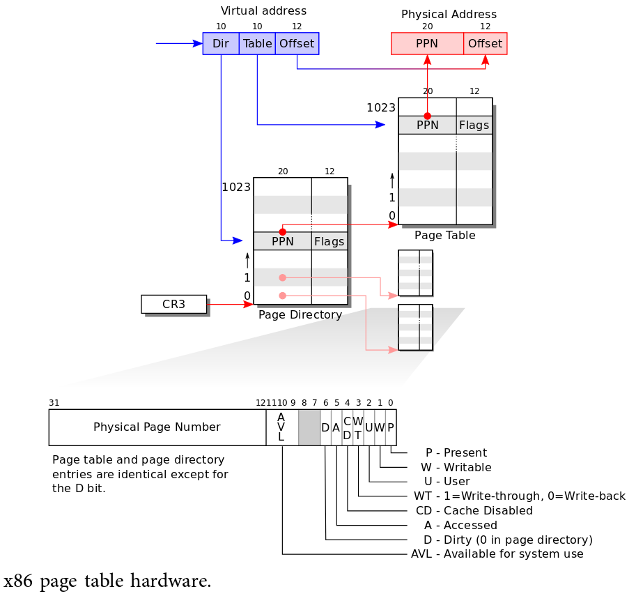

# Paginador xv6

1. Entrega no domingo após a segunda prova
1. Pode ser feito em dupla

Parte deste material foi adaptado do material do
[Remzi H. Arpaci-Dusseau](http://www.cs.wisc.edu/~remzi). Outra parte foi
adaptada do material do
[MIT](https://pdos.csail.mit.edu/6.828/2016/index.html). Por fim, também
peguei dicas do curso da
[Stonybrook](https://www3.cs.stonybrook.edu/~porter/courses/cse306/s16/lab2.html).

Neste TP vamos explorar alguns conceitos da segunda parte da disciplina.  Em
particular, vamos rever os conceitos de memória virtual e páginas *copy on
write*. O objetivo é que o aluno entenda como funciona a memória virtual
inserindo um nova chamada de sistema no xv6.

1. [Tutorial xv6](#tutorial)
2. [Especificação](#especificação)

Recomendo ler o [Capítulo 2 do livro xv6](https://pdos.csail.mit.edu/6.828/2016/xv6/book-rev9.pdf).
São poucas páginas que explicam diversos conceitos que vamos utilizar.

## Tutorial

Antes de iniciar o ambiente xv6 você precisa instalar alguns programas no seu
ambiente Linux Ubuntu. Como nos outros trabalhos, recomendo **fortemente** que
use um ambiente Linux ou uma VM. De qualquer forma, coloquei instruções de como
configurar o xv6 no Windows/macOSx mais abaixo.

### Configurando o ambiente

**Ubuntu**

No Ubuntu, rode os seguintes comandos para instalar o gcc, qemu, git e o
build-essentials.

```
$ sudo apt-get update
$ sudo apt-get install build-essential
$ sudo apt-get install gcc-multilib
$ sudo apt-get install qemu
$ sudo apt-get install git
$ sudo apt-get install nasm
```

**Windows/macOSx**

Para usuários Windows instaler o Linux Subsystem for Windows, veja
como [aqui](https://msdn.microsoft.com/en-us/commandline/wsl/install_guide).
No macOSx você deve precisar do [Homebrew](https://brew.sh). Após instalar as
ferramentas no seu Windows/macOSx, veja as instruções para ter um ambiente xv6
[aqui](https://gcallah.github.io/OperatingSystems/xv6Install.html).

**Clonando**

Rode o comando:

```
$ git clone https://github.com/mit-pdos/xv6-public.git
```

Depois entre na pasta xv6-public.

### Compilando e Rodando o xv6

Após entrar na pasta `xv6-public` digite:

```
$ make
```

Para executar digite:

```
$ make qemu-nox              # ou make qemu caso prefira uma janelinha com o xv6
```

Se sua saída for algo como a abaixo, então você fez tudo corretamente:

```
$ make qemu-nox
qemu-system-i386 -nographic -drive file=fs.img,index=1,media=disk,format=raw -drive file=xv6.img,index=0,media=disk,format=raw -smp 2 -m 512
xv6...
cpu1: starting 1
cpu0: starting 0
sb: size 1000 nblocks 941 ninodes 200 nlog 30 logstart 2 inodestart 32 bmap start 58
init: starting sh
```

O xv6 vem com alguns comandos como ls, cat, echo. Teste alguns

```
$ ls
.              1 1 512
..             1 1 512
README         2 2 2632
cat            2 3 13004
echo           2 4 12096
forktest       2 5 7780
grep           2 6 14612
init           2 7 12652
kill           2 8 12140
ln             2 9 12012
ls             2 10 14168
mkdir          2 11 12188
rm             2 12 12164
sh             2 13 22460
stressfs       2 14 12844
usertests      2 15 54992
wc             2 16 13536
zombie         2 17 11844
console        3 18 0
```

### Controlando a VM

Provavelmente você vai utilizar só o comando **quit**, mas segue uma lista de
alguns outros comandos do qemu que podem ser interessantes.

* Control-a-c
  1. **info registers** to show CPU registers
  1. **x/10i $eip** show the next 10 instructions at the current instruction pointer
  1. **system-reset** reset & reboot the system
  1. **quit** exit the emulator (quit xv6)

```
qemu-system-i386 -nographic -drive file=fs.img,index=1,media=disk,format=raw -drive file=xv6.img,index=0,media=disk,format=raw -smp 2 -m 512
xv6...
cpu1: starting 1
cpu0: starting 0
sb: size 1000 nblocks 941 ninodes 200 nlog 30 logstart 2 inodestart 32 bmap start 58
init: starting sh
$ QEMU 2.3.0 monitor - type 'help' for more information
(qemu)
```

* Control-a-x
  1. Desliga a VM

```
qemu-system-i386 -nographic -drive file=fs.img,index=1,media=disk,format=raw -drive file=xv6.img,index=0,media=disk,format=raw -smp 2 -m 512
xv6...
cpu1: starting 1
cpu0: starting 0
sb: size 1000 nblocks 941 ninodes 200 nlog 30 logstart 2 inodestart 32 bmap start 58
init: starting sh
$ QEMU: Terminated
```

### Adicionando um esqueleto de uma nova chamada de sistema e um novo comando

Agora vou mostrar um passo a passo como adicionar uma nova chamada de sistema
no xv6. Use esse passo a passo como base para seu TP. Vamos adicionar uma
chamada de sistema retornar a data do sistema. Após adicionar a chamada de
sistema vamos criar também um comando do sistema chamado `date`.

**Passo 0: Entendendo o Código xv6**

Para adicionar uma chamada de sistema vamos precisar alterar alguns arquivos do
xv6.

1. `user.h:` Define as chamadas que são vísiveis ao usuário.  (stat, strcpy,
   printf, etc.). Esse arquivo define a "biblioteca padrão" do xv6 para o usuário.
1. `syscall.h:` Define os números de cada chamada de sistema. Para implementar
   uma nova você precisa adicionar uma nova entrada no `syscall.h:`. Garanta que
   os números são contíguos. Tal número vai ser usado no `syscall.c`
1. `syscall.c:` Este arquivo tem as funções responsáveis por
   realmente chamar o código da nova chamada de sistema. Em particular vamos
   estudar a função `void syscall(void)`.
1. `usys.S:` Macros assembly para chamar cada chamada de sistema. O código no
   `usys.S` simplesmente coloca o número da chamada de sistema no registrador
   `eax` e invoca o `void syscall(void)` do `syscall.c`.
   Você vai precisar adicionar uma linha neste arquivo.
1. `sysproc.c:` Sua nova chamada do sistema vai ser implementada aqui.
   O mesmo contém o código das chamadas de sistema que o xv6 oferece para seus
   processos/usuários.

Vamos iniciar dando uma olhada no `syscall.c` do xv6. Em particular,
dê uma olhada na função `void syscall(void)`.

```c
void
syscall(void)
{
  int num;
  struct proc *curproc = myproc();

  num = curproc->tf->eax;
  if(num > 0 && num < NELEM(syscalls) && syscalls[num]) {
    curproc->tf->eax = syscalls[num]();
  } else {
    cprintf("%d %s: unknown sys call %d\n",
            curproc->pid, curproc->name, num);
    curproc->tf->eax = -1;
  }
}
```

Note que na linha `curproc->tf->eax` o número da chamada de sistema é
identificado através do valor do registrador `eax`. O mesmo campo recebe
o retorno da chamada depois de que saímos. Antes da chamada o `eax` contém
o primeiro parâmetro que indica o número da chamada.

Estude struct do processo definido no arquivo `proc.h`. Pode lhe ajudar
a entender como o xv6 gerencia processos e trata traps. Em particular,
note o campo `trapframe`. O mesmo pode ser encontrado no `x86.h`.

```c
enum procstate { UNUSED, EMBRYO, SLEEPING, RUNNABLE, RUNNING, ZOMBIE };

// Per-process state
struct proc {
  uint sz;                     // Size of process memory (bytes)
  pde_t* pgdir;                // Page table
  char *kstack;                // Bottom of kernel stack for this process
  enum procstate state;        // Process state
  int pid;                     // Process ID
  struct proc *parent;         // Parent process
  struct trapframe *tf;        // Trap frame for current syscall
  struct context *context;     // swtch() here to run process
  void *chan;                  // If non-zero, sleeping on chan
  int killed;                  // If non-zero, have been killed
  struct file *ofile[NOFILE];  // Open files
  struct inode *cwd;           // Current directory
  char name[16];               // Process name (debugging)
};
```

**Passo 1: Esqueleto da chamada de sistema**

Suas chamadas de sistemas vão morar no arquivo `sysproc.c`. Então, você pode
usar o esqueleto abaixo para implementar a mesma.

```c
int
sys_date(void)
{
  char *ptr;
  argptr(0, &ptr, sizeof(struct rtcdate*));
  // seu código aqui
  return 0;
}
```

O passo mais importante aqui é a chamada `argptr`. Toda chamada de sistema no
xv6 recebe void como entrada. Parece esquisito, mas lembre-se que estamos no
meio do tratamento de um trap. Além disso, cada chamada do sistema vai ter
parâmetros diferentes e precisamos de uma forma comum de chamar toda e qualquer
chamada de sistema. Por isso, o xv6 tem as chamas `argptr`, `argint` e `argstr`
para pegar da pilha parâmetros do tipo: ponteiro para qualquer coisa (que vem
como char, faça cast), inteiros e strings.

```c
// Fetch the nth 32-bit system call argument.
int argint(int n, int *ip);

// Fetch the nth word-sized system call argument as a pointer
// to a block of memory of size bytes.  Check that the pointer
// lies within the process address space.
int argptr(int n, char **pp, int size);

// Fetch the nth word-sized system call argument as a string pointer.
// Check that the pointer is valid and the string is nul-terminated.
// (There is no shared writable memory, so the string can't change
// between this check and being used by the kernel.)
int argstr(int n, char **pp);
```

**Passo 2: Adicionando sua system call no vetor de tratamentos**

Para que seu código seja chamado você deve alterar alguns arquivos do kernel.
Em particular você deve alterar os arquivos:

1. `syscall.h:` adicionar o número da nova chamada
1. `syscall.c:` ver o vetor que mapeia o número da chamada de sistema para a
   função que implementa a mesma. Tal vetor se chama `static int
   (*syscalls[])(void)`.
1. `user.h:` adicionar a chamada que vai ser visível para o usuário. Note que
    essa chamada não é implementada, é só o esqueleto que o usuário vê.
    Eu usei: `int date(void*);` No fim, o usys.S quem trata tais chamadas.
1. `usys.S`: adicionar 1 linha para a chamada. Esse é o código assembly que
    chaveia do `user.h` para a sua chamada do passo 0.

**Passo 3: Novo Comando**

Agora crie um arquivo `date.c` com o seguinte conteúdo:

```c
#include "types.h"
#include "user.h"
#include "date.h"

int stdout = 1;
int stderr = 2;

int
main(int argc, char *argv[])
{
  struct rtcdate r;

  if (date(&r)) {
    printf(stderr, "Erro na chamada de sistema\n");
    exit();
  }

  // Imprima a data aqui

  exit();
}
```

Depois, no `Makefile` coloque uma linha para que seu novo comando faça parte
do sistema. Para isto basta colocar uma linha `_date` (ver abaixo).

```make
UPROGS=\
	_cat\
	_date\
	_echo\
	_forktest\
	_grep\
	_init\
	_kill\
	_ln\
	_ls\
	_mkdir\
	_rm\
	_sh\
	_stressfs\
	_usertests\
	_wc\
	_zombie\
```

**Passo 4: Compilando e Testando**

Assumindo que tudo foi feito corretamente, compile seu sistema operacional.

```
$ make
```

Se tudo deu certo execute o mesmo.

```
$ make qemu-nox
```

E teste seu comando date:

```
$ date
```

Se nada for impresso, sem problemas, o comando ainda está incompleto. Se algum
erro ocorrer em algum dos passos acima, você deve ter cometido algum erro.

## Especificação

### TP2.1: Data (Terminando o Tutorial)

Com os passos acima você sabe adicionar uma chamada de sistema no xv6. Na
primeira parte do TP termine a chamada de data para ter certeza que entendeu
todos os passos e arquivos. Só isso, pode imprimir a data da forma que quiser.

### TP2.2: Chamadas de Sistema para lhe auxiliar

Agora vamos começar a entender como é feito o gerenciamento de memória no x86
junto com o xv6. Para o caso específico de uma arquitetura x86, quando o processo
executa a tabela de páginas é atualizada diretamente pelo hardware.
Lembrando que a tabela de página x86 tem a seguinte forma (imagem do livro
[xv6](https://pdos.csail.mit.edu/6.828/2016/xv6/book-rev9.pdf)).



Da figura, note que o endereço inicial da tabela de página é alocada no
registrador CR03. Tal registrador é atualizado quando chaveamos de um processo
para outro no xv6. Em particular, tal mudança é feita na função `switchuvm` do
arquivo `vm.c`.

```c
// Switch TSS and h/w page table to correspond to process p.
void
switchuvm(struct proc *p)
{
  if(p == 0)
    panic("switchuvm: no process");
  if(p->kstack == 0)
    panic("switchuvm: no kstack");
  if(p->pgdir == 0)
    panic("switchuvm: no pgdir");

  pushcli();
  mycpu()->gdt[SEG_TSS] = SEG16(STS_T32A, &mycpu()->ts, sizeof(mycpu()->ts)-1, 0);
  mycpu()->gdt[SEG_TSS].s = 0;
  mycpu()->ts.ss0 = SEG_KDATA << 3;
  mycpu()->ts.esp0 = (uint)p->kstack + KSTACKSIZE;
  // setting IOPL=0 in eflags *and* iomb beyond the tss segment limit
  // forbids I/O instructions (e.g., inb and outb) from user space
  mycpu()->ts.iomb = (ushort) 0xFFFF;
  ltr(SEG_TSS << 3);
  lcr3(V2P(p->pgdir));  // switch to process's address space
  popcli();
}
```

Em particular a mudança ocorre na penúltima linha (`lcr3(V2P(p->pgdir))`). As
linhas anteriores atualizam os segmentos presentes no x86, pode ignorar as mesmas.
Note o use da macro **V2P**. Macros como essa ajudam a mapear endereços reais para
virtuais e vice versa. Veja as mesmas nos arquivos `mmu.h` e `memlayout.h`.
O hardware conhece endereços reais `V2P`, enquando o kernel/usuários conhecem
endereços virtuais `P2V`.

**Flush da TLB**

Lembre-se que a tabela de páginas pode ser alterada pelo HW e
pelo SW. No x86, o papel do SW (kernel) é basicamente criar as novas entradas.
Vide as flags no `mmu.h` utilizadas para tal inicialização.
Quando novas páginas são criadas/inicializadas, o HW então atualiza as flags
da mesma enquanto o código executa. Sabendo disso, uma forma de indicar para
o HW que a tabela mudou (criamos uma nova entrada por exemplo) é a
seguinte chamada:

```c
lcr3(lcr3(V2P(p->pgdir)))
```

A mesma seta o registrador CR3 para a tabela de páginas do processo.  Ao setar
tal registrador, o hardware limpa a TLB. Limpar a TLB é importante pois a
a TLB é um cache que se não for atualizado gera inconsistências entre a tabela
real e o valor na TLB.

*Sempre que você mudar a tabela, mesmo se for só setando 1 bit, faça flush*

**Endereços virtuais, page table entries e endereços físico**

Outra função importante é a `walkpgdir`. Tal função recebe um endereço virtual
e retorna um endereço real. A mesma existe no arquivo `vm.c`.

```c
// Return the address of the PTE in page table pgdir
// that corresponds to virtual address va.  If alloc!=0,
// create any required page table pages.
static pte_t *
walkpgdir(pde_t *pgdir, const void *va, int alloc)
{
  pde_t *pde;
  pte_t *pgtab;

  pde = &pgdir[PDX(va)];
  if(*pde & PTE_P){
    pgtab = (pte_t*)P2V(PTE_ADDR(*pde));
  } else {
    if(!alloc || (pgtab = (pte_t*)kalloc()) == 0)
      return 0;
    // Make sure all those PTE_P bits are zero.
    memset(pgtab, 0, PGSIZE);
    // The permissions here are overly generous, but they can
    // be further restricted by the permissions in the page table
    // entries, if necessary.
    *pde = V2P(pgtab) | PTE_P | PTE_W | PTE_U;
  }
  return &pgtab[PTX(va)];
}
```

A função recebe:
  * Endereço virtual como `char*`.
  * Um ponteiro para o diretório da tabela de páginas (`pde_t`)
  * Retorna um ponteiro para a entrada na tabela *table entry* (`pte_t`)

É importante entender a diferença entre os 3 tipos acima, pois faremos uso
dos três para o TP.

**Alocando novos frames**

Por fim, é importante estudar o código que aloca novos frames/molduras.
Quando uma página é criada a mesma vai fazer uso da função `kalloc`.  Quando é
liberada o `kfree` é chamado. As duas chamadas estão no arquivo `kalloc.c`.
O kalloc pega o próximo frame de 4kb e retorna. Tal frame deve ser inserido na
tabela de páginas. O kfree marca o frame como livre.

**Com o conhecimento acima implemente**

Uma chamada `virt2real` que recebe um endereço virtual (`char*`) e retorna um
endereço real. No `user.h` a mesma tem o seguinte cabeçalho:

```c
char* virt2real(char *va);
```

Para retornar um `char*` pode fazer cast para int no `sysproc.c`.

Além da chamada acima, implemente uma função `int num_pages(void)` que
retorna o número de páginas que um processo faz uso (referencia).

```c
int num_pages(void);
```

As duas funções precisam acessar o processo atual. Use a chamada `myproc`.

### TP2.3: Páginas Copy-on-Write

Por fim, crie uma chama de sistema chamada `forkcow`. A mesma tem que ter a
mesma assinatura da chamada `fork`. Copie e cole a chamada fork, recomendo
ter as duas chamadas para depurar eventuais erros.

Diferente da chamada `fork`, `forkcow` cria um processo filho com páginas
copy on write.  Uma boa parte do esforço do comando `fork` é a função `copyuvm`.
Então, crie **uma função** nova `copyuvmcow`.

Os passos a seguir são:

1. Guardar o número de referências para um frame/moldura.
   Vai ser útil para o copy on write. Para tal, implemente ou use uma
   estrutura já pronta (ver `kalloc.c`) que guarda tal quantidade de
   referências.
1. Garantir que o `forkcow` usa as mesmas molduras do parent.
   Para cada fork, adicione o número de referências para a moldura.
1. Setar paginas como READ ONLY. Ver flags do `mmu.h` e como são setadas
   no `vm.c` (perto das chamadas `kalloc`). `*pte &= ~PTE_W`.
1. Note (vide figura acima) que a tabela de páginas tem bits extra para
   informação do sistema. Então, use tais bits para indicar que a página
   é COW (setando uma flag PTE_COW em um bit livre).

Com os 4 passos acima você deve ter um processo child que é
**read only**. Agora vem o passo mais importante, sempre que o hardware
indicar uma trap de PAGEFAULT você deve criar uma página nova para o
filho. Para tratar a PAGEFAULT inicie no arquivo `trap.c`. Veja como o mesmo
trata a systemcall e inicie com um código similar.

1. Certifique-se de que a falta de página é de escrita em um endereço de
   usuário. Use o campo `tf->err` e as flags.
1. Para determinar o endereço virtual que gerou a fault use o registrador
   CR2: `uint va = rcr2();`.
1. Certifique-se que é uma página PTE_COW. Se não, algo esquisito ocorreu (o
   programa quer acessar um endereço inválido).
1. Crie uma página nova caso seja necessário.
   1. Será necessário quando: A página é compartilhada com o pai. Para saber
      disto, você pode usar seu contador que indica a quantidade de processos
      que referenciam a página (atualize o mesmo ao criar childs). Se o
      contador for maior do que 1 então faça uma cópia.
   1. **Não** será necessário quando. O contador do número de referências for
      `==1`. Neste caso, apenas um processo referência a página e mesma pode
      ser escrita. Remova a flag PTE_COW e sete a página como writeable.

*Nos dois casos acima realize o flush na TLB (ver mais acima).*

Para utilizar o `tf->err` você precisa saber dos bits utilizados para definir
qual tipo de PAGEFAULT ocorreu:

```
 31              4               0
+---+--  --+---+---+---+---+---+---+
|   Reserved   | I | R | U | W | P |
+---+--  --+---+---+---+---+---+---+
```

Então, para saber se uma falta foi de escrita faça:

```c
if (tf->ef & 0x2)
```

## Testes automatizados

Copie o [corretor.c](./corretor.c) para o local do seu código e altere o
Makefile para compilar o mesmo. Ao entrar no xv6 rode 2 comandos:

```
$ forktest
$ corretor
```

Se os dois funcionarem seu TP está OK!
